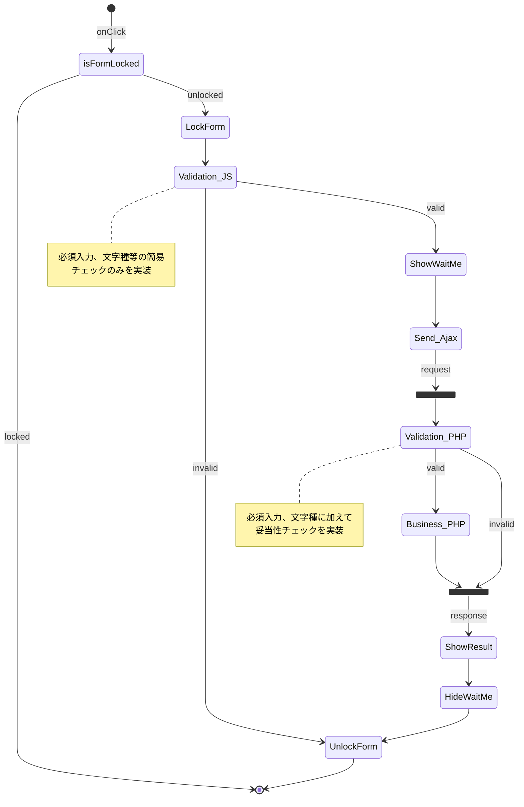

```mermaid
stateDiagram
    [*] --> isFormLocked :onClick
    isFormLocked --> [*]: locked
    isFormLocked --> LockForm: unlocked
    LockForm --> Validation_JS
    note right of Validation_JS
      必須入力、文字種等の簡易チェックのみを実装
    end note
    Validation_JS --> UnlockForm: invalid
    Validation_JS --> ShowWaitMe: valid
    ShowWaitMe --> Send_Ajax

    state fork_state <<fork>>
      Send_Ajax --> fork_state: request
      fork_state --> Validation_PHP
      note right of Validation_PHP
        必須入力、文字種に加えて妥当性チェックを実装
      end note
      Validation_PHP --> Business_PHP: valid

    state join_state <<join>>
      Validation_PHP --> join_state: invalid
      Business_PHP --> join_state
      join_state --> ShowResult: response

    ShowResult --> HideWaitMe
    HideWaitMe --> UnlockForm
    UnlockForm --> [*]
```
